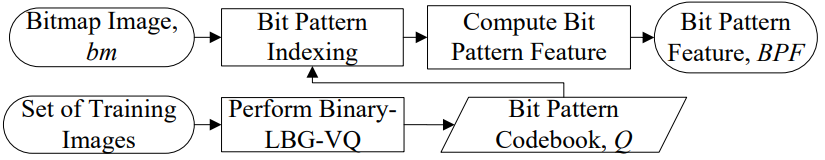
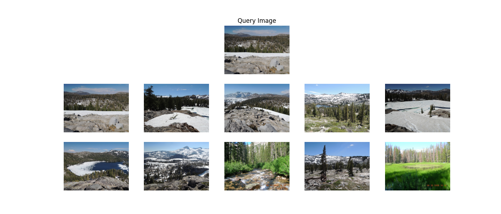

# EL5206 Proyecto de Imágenes

Proyecto final del curso EL5206, el cual trata sobre la implementación de un algoritmo *Content Based Image Retrieval* (CBIR). En este algortimo, un usuario utiliza una imagen de búsqueda para obtener una lista ordenada de un conjunto de imágenes pre-cargadas.

Para esta implemetaqnción se ha debido emplear 2 métodos distintos: uno usando una red neuronal pre entrenada, y un método con extracción manual de características.

Un CBIR consiste en un buscador de imágenes, siendo la búsqueda realizada por medio de otra imagen. La siguiente FIgura muestra un esquema de las etapas encontradas en un CBIR.


Para llevar a cabo este proyecto se han utilizado las siguientes bibliotecas de python:

- matplotlib
- numpy
- opencv
- scikit-image
- scikit-learn
- scipy
- torch
- torchvision


## Cálculo de vector de características

### Extracción de características: modelo clásico
Las características seleccionadas para la comparación de imágenes en el modelo clásico o *handcrafted* consisten en *Color Co-occurrence Feature* (CCF) y *Bit Pattern Feature* (BPF). La selección de estas características se basa en querer una característica capaz de captar la información de los colores de cada imagen, y otra capaz de obtener información sobre los bordes y formas. Según [1], las características antes mencionadas son capaces de extraer dicha información de las imágenes.

La extracción de estas características se basa en un algoritmo de compresión de imágenes llamado *Block Truncation Coding* (BTC). Este algoritmo particiona la imagen en bloques sin traslape, y sobre cada uno de estos bloques obtiene 2 colores $x_1$ y $x_2$ y un *bitmap* (array que sólo contiene 1s y 0s) de las mismas dimensiones de los bloques. Con esta información, se procede a generar una nueva imagen, que en cada pixel asigna el valor mínimo o máximo del bloque correspondiente, de acuerdo a los bitmaps generados.

Una variante de BTC corresponde a EDBTC (*Error Diffussion Block Truncation Coding*). En este algoritmo, también se utilizan bloques sin traslape, y se obtienen 2 colores y un bitmap por bloque. La diferencia radica en que los colores obtenidos en este caso corresponden al mínimo y máximo por bloque en lugar de realizar un cálculo numérico, y para la generación del bitmap se utiliza un filtro con el objetivo de emular el filtro pasa bajos que existe en la visión humana.

El detalle de este algoritmo se presenta a continuación:

La imagen original de tamaño $M\times N$ se divide en bloques sin traslape de tamaño $m\times n$, obteniendo un conjunto de bloques $\{b(i,j); i = 1,2,\cdots , \frac{M}{m}; j = 1,2,\cdots , \frac{N}{n} \}$. Cada par $(i,j)$ dentro un bloque representa el color de un pixel.

- Cuantización de colores

Para cada bloque, se extrae el color mínimo y máximo. En el espacio de colores $RGB$, el valor mínimo y máximo se encuentran de la siguiente forma:

$$x^b_{min} = \left(\min_{\forall (i,j) \in b}{b_R(i,j)}, \min_{\forall (i,j) \in b}{b_G(i,j)}, \min_{\forall (i,j) \in b}{b_B(i,j)} \right)$$
$$x^b_{max} = \left(\max_{\forall (i,j) \in b}{b_R(i,j)}, \max_{\forall (i,j) \in b}{b_G(i,j)}, \max_{\forall (i,j) \in b}{b_B(i,j)} \right)$$

En donde $b_R$, $b_G$ y $b_B$ corresponden a la separación del bloque $b$ en sus respectivos canales $RGB$. Las ecuaciones anteriores equivalen a tratar cada canal por separado, encontrando el valor mínimo y máximo para cada canal, y luego generando $x_{min}$ y $x_{max}$ concatenando los respectivos mínimos y máximos.

- Bitmap

La imagen original se transforma a escala de grises. Luego, esta nueva imagen se divide en los mismos bloques $b$ de tamaño $m\times n$ de la etapa de cuantización de colores. Sobre cada bloque $b$ se calcula el color promedio $\overline{x}$ y se encuentra un nuevo bloque $o$ de la siguiente manera:

$$o(i,j) = \left\{ \begin{array}{llcr}
  x_{max} & \text{si } b(i,j) & \geq & \overline{x} \\
  x_{min} & \text{si } b(i,j) & < & \overline{x}
\end{array} \right .$$

Una vez que se ha calculado el bloque $o$, se obtiene un *residual quantization error* como sigue:

$$e(i,j) = b(i,j) - o(i,j)$$

El bloque $b$ es actualizado, al sumar el error de cada pixel difuminado sobre los pixeles vecinos por medio de una convolución con un filtro. De acuerdo a [2], un filtro adecuado para esta operación corresponde al de *Floyd-Steingerb*.

$$b(i,j) = b(i,j) + e(i,j) \ast kernel$$

Finalmente, el bitmap $h$ que se utilizará para asignar los colores cuantizados se obtiene de realizar un thresholding sobre el bloque actualizado $b$.

$$h(i,j) = \left\{ \begin{array}{llcr}
  1 & \text{si } b(i,j) & \geq & \overline{x} \\
  0 & \text{si } b(i,j) & < & \overline{x}
\end{array} \right .$$

La siguiente figura extraida de [3] muestra un ejemplo de la compresión de una imagen por medio de EDBTC.


Para extraer las características antes señaladas, no se requiere pasar por el proceso de comprimir la imagen usando los colores y el bitmap obtenidos. En su lugar, se extraen directamente los valores de $x_{min}$ y $x_{max}$ de todos los bloques para computar el vector de características CCF, y se extraen todos los bloques $h$ que forman el bitmap para calcular el vector de características BPF. Finalmente, se concatenan los vectores CCF y BPF para retornar un único vector de características por imagen.

- Obtención de Color Co-occurrence Feature (CCF)

La idea central de esta característica es que la distribución de los colores en una imagen entrega información valiosa sobre su contenido. Esta información puede ser extraida por medio de una matriz de co-ocurrencia de colores, la que se obtiene al calcular la probabilidad de ocurrencia de cada par de colores definidos por 2 códigos de colores. El diagrama de la siguiente figura (extraída de [1]) muestra el procedimiento para el cálculo de esta característica.


Se generan 2 conjuntos de entrenamiento, uno de ellos con los valores de $x_{min}$ de los bloques de varias imágenes, y otro de ellos con los valores análogos de $x_{max}$. Estos conjuntos de entrenamiento se utilizan en un algoritmo de clustering para encontrar los colores más representativos de las imágenes, definiendo de esta forma un código de colores para valores mínimos y otro para valores máximos. En el trabajo original, se ha usado el algoritmo LBG-VQ, el cuál ha sido reemplazado por el algoritmo k-means en este trabajo.

El código de colores es finalmente un mapeo de un conjunto de números naturales al conjunto de colores encontrados por el algoritmo de clustering. Se debe notar que es en este paso cuando se decide el tamaño del vector de características CCF, pues este tamaño será identico a la cantidad de colores en los códigos de colores. Así, si se utilizan 32 colores para cada código de colores, el tamaño del vector de características CCF será de 32.

Una vez obtenidos los códigos de colores, se procede a realizar el indexing de colores de cada imagen. Este procedimiento consta de comparar cada valor de $x_{min}$ y $x_{max}$ de una imagen con su respectivo código de colores, y se le asigna a cada valor el índice del color más cercano en el código de colores. El color más cercano se define por medio de la distancia euclidiana:

$$i_{min}(n) = \argmin_{q=1,2, \cdots, N_C}{||X_{min}(n) - C_{min}(q)}||$$

En donde $X_{min}$ es un vector con los $N$ valores de $x_min$ de la imagen, $C_{min}$ es el código de colores para valores mínimos, $q$ es un índice de $C_{min}$, y $N_C$ es el tamaño del código de colores. De forma análoga, el indexing de valores máximos se define como sigue:

$$i_{max}(n) = \argmin_{q=1,2, \cdots, N_C}{||X_{max}(n) - C_{max}(q)}||$$

Con los indexing de colores calculados de una imagen, se puede obtener la matriz de co-ocurrencia de colores. Dicha matriz es de $N_C\times N_C$, y en cada celda $(i,j)$ guarda la cantidad de veces que el índice $i$ del código de colores mínimo aparece en la misma posición que el índice $j$ del código de colores máximo, dividido por $N_C^2$. Este cálculo equivale a la probabilidad de ocurrencia de 2 índices de forma simultanea.

$$CCF(i,j) = Pr(i_{min}(n) = i, i_{max}(n) = j \text{ | } \forall n \in \{1,\cdots , N\})$$

Finalmente, el vector de características se obtiene al sumar todos los valores de cada fila de la matriz CCF, lo que resulta en un vector de tamaño $N_C$.

- Obtención de Bit Pattern Feature (BPF)



La Figura anterior (extraída de [1]) muestra un diagrama con los pasos a seguir para calcular el vector BPF. El procedimiento es similar al utilizado en el cálculo del vector CCF: se genera un conjunto de entrenamiento con varias imágenes, se entrena un algoritmo de clustering con los bitmaps de estas imágenes, y se obtiene un código de bitmaps con la cantidad de bitmaps deseadas. Para el entrenamiento del clustering, se debe tomar en cuenta que un bitmap sólo puede contener valores 0 o 1, por lo que en algún momento del algoritmo se debe realizar un thresholding para que cualquier valor en el intervalo $[0,1]$ adquiera alguno de los 2 valores permitidos. De acuerdo a [4], una buena forma lograr lo anterior consiste en entrenar con *soft centrids*: esto es, relajar la condición antes mencionada y dejar que durante el entrenamiento existan bitmaps con valores entre 0 y 1. Cuando al fin se han encontrado los btmaps deseados, es cuando se realiza el thresholding para que todos los valores de los bitmaps sólo puedan ser 0 o 1.

Una vez que se cuenta con el código de bitmaps, se procede a indexar los bitmaps de cada imagen por medio de la distancia de Hamming.

$$i_{bitmap}(n) = \argmin_{q=1,2, \cdots, N_B}{\text{Hamming}(H(n), C_b(q))}$$

$H$ contiene los $N$ bitmaps de una imagen, $C_B$ es el código de bitmaps obtenido previamente, y $N_B$ es la cantidad de bitmaps existentes en el código de bitmaps.

Una vez que se cuenta con el indexing de bitmaps, sólo resta un paso para obtener el vector BPF. Para ello, se calcula la cantidad de ocurrencias de cada bitmap en el código de bitmaps, y se divide por el total $N_b$. Este cálculo coincide con la probabilidad de ocurrencia de cada bitmap en la imagen.

$$BPF(q) = Pr(i_{bitmap}(n) = i \text{ | } \forall n \in \{1,\cdots , N\})$$


### Extracción de características: CNN

Para la obtención de un vector de características por medio de una red neuronal, se ha usado la red pre entrenada DenseNet-121.

La particularidad de Dense Convolutional Network (DenseNet)[5] es que realiza una conexión entre todas las capas. Esto es distinto de la forma en que usualmente se conectan las capas en una red convolucional, pues se suele conectar una capa solamente con la capa que le sigue. Gracias a estas conexiones, las características extraidas en todas las capas anteriores son utilizadas en las capas siguientes, aliviando problemas como el desvanicimiento del gradiente y reduciendo el número de parámetros.


La figura anterior (extraida de [5]) muestra la arquitectura de las distintas redes DenseNet. Para este proyecto se ha seleccionado la red DenseNet-121, utilizando como vector de características la capa de global average pooling previa a la capa fully connected.

La implementación de esta extracción de características se ha desarrollado gracias al modelo preentrenado que entrega el framework Pytorch. Además, se han utilizado algunas transformaciones útiles recomendadas para la extracción de las características de imágenes, entre las que se incluye un redimensionamiento de las imágenes a un tamaño de 224 $\times$ 224 pixeles, obteniendo así un vector de características entregado por la red de 1024 características.

Una vez que ambos modelos de extracción de características han sido implementados, se procede a extraer las características de todas las imágenes de los 2 datasets proporcionados, y guardarlos para posteriores consultas.


## Image Retrieval

Una vez que se cuenta con los vectores de características de todas las imágenes, se procede a implementar los siguientes pasos para la recuperación de las imágenes parecidas en los datasets. Lo primero que se realiza es definir la medida de similitud. Por simplicidad, se ha decidido utilizar la distancia euclideana entre la imagen de prueba y todas las imágenes del dataset del que proviene la imagen. El código utilizado para esta medida de similitud se encuentra a continuación.

```python
def euclidean_distance(features, dataset_features):
    euclidean_dist = np.sqrt(np.power(dataset_features - features, 2).sum(axis=1))
    return euclidean_dist
```

Luego, se implementa una función que entrega los nombres de las imágenes ordenadas por la distancia previamente definida. De esta forma, si se quieren consultar las primeras 10 imágenes entregadas por el modelo, se pueden extraer los primeros 10 nombres entregados por esta función.

```python
def retrieve_imgs(img_name, img_dir, dataset, feature_extractor):
    img = load_img(os.path.join(img_dir, img_name))
    features = get_img_features(img, feature_extractor, **kwargs)
    dataset_features = np.load(f'features/{dataset}_{feature_extractor}_features.npy')
    with open(f'features/{dataset}_img_names.pickle', 'rb') as data:
        img_names = pickle.load(data)
    

    distances = euclidean_distance(features, dataset_features)
    sorted_args = np.argsort(distances)
    sorted_imgs = [img_names[i] for i in sorted_args]

    return sorted_imgs
```

En el código anterior, *load_img* es una función que se encarga de cargar una imagen dado un *path*; *get_img_features* es una función que entrega el vector de características de la imagen cargada, indicando cuál es el extractor de características que se desea usar: *handcrafted* o *cnn*. La variable *dataset_features* se encarga de obtener los valores previamente computados del dataset solicitado, y finalmente se calcula la distancia entre las características de la imagen y las características almacenadas del dataset. Las últimas lineas ordenan estos resultados de acuerdo a la distancia, y se entrega una lista con los nombres de las imágenes ordenadas.


## Métricas de evaluación

Para medir el desempeño de los modelos, se ha obtenido el rank normalizado de todas las imágenes de búsqueda, y luego se ha calculado el promedio de estos ranks. De esta forma, se tiene un valor con el que se pueden comparar los modelos.

Para entender la métrica utilizada, primero se explica qué es el Rank y el Rank normalizado. Rank consiste en la posición promedio de las imágenes relevantes de una búsqueda, mientras que el Rank normalizado es una normalización de Rank, que entrega un valor en el intervalo $[0,1]$: 0 si todas las imágenes relevantes se encuentran en las primeras posiciones de la búsqueda, y 1 cuando todas las imágenes relevantes se encuentran en las últimas posiciones de la búsqueda. Un valor de 0.5 indica una búsqueda aleatoria.

Sabiendo lo anterior, el promedio de los rank normalizados entrega información sobre qué tan lejos o cerca se encuentran las imágenes similares de una búsqueda, en promedio. El valor de esta métrica para cada modelo y extractor de características se encuentra a continuación:

| | **Handcrafted**  | **CNN**|
| :---: | :---: | :---: |
| **Holidays** | 0.460 | 0.015 |
|**GPR1200**| 0.402 | 0.040 |

Las métricas presentadas para el modelo *handcrafted* no son tan alentadoras, pues se esperaba que el modelo tuviese un mejor desempeño. Según [1], las características que se han utilizado en este trabajo también fueron testeadas sobre el dataset *holidays*, y aunque las métricas utilizadas no son las mismas, se puede notar que tiene una performance mucho mejor.

La primera señal de problemas con respecto al modelo *handcrafted* consiste en el tiempo necesario para extraer las características. Según los autores que introdujeron las características CCF y BPF, el tiempo que tarda este algoritmo en realizar el indexing es del orden de decenas de [ms], mientras que en la presente implementación el tiempo es del orden de segundos. Para determinar la causa de esta discordancia entre los resultados de las referencias y el presente trabajo, se ha analizado el código y se ha consultado nuevamente la literatura. Tras realizar lo anterior, se ha logrado percatar que existe un error de implementación. Como se ha mencionado en la sección de extracción de características, el clustering que entrega los códigos de colores y el código de bitmaps debe realizarse con un conjunto de imágenes de entrenamiento, pero en este trabajo se han obtenido los codebooks por cada imagen. De esta forma, en lugar de realizar un único entrenamiento para determinar los códigos de colores y de bitmap, el algoritmo de clustering se ha entrenado por cada vez que se requiere obtener las características de una imagen.

Una consecuencia inmediata de lo anterior consiste en la ineficiencia del algoritmo. Un procedimiento que podría ser realizado en pocas ocasiones, se ha llevado a cabo por cada vez que se procesa una imagen, motivo por el que la extracción de las características del dataset *GPR1200* ha tardado varias horas. Además de dicha desventaja, también se ha podido percatar que existen imágenes para las que el código de colores no consigue entregar la cantidad de colores deseadas. El siguiente warning se muestra en dichos casos:

```python
ConvergenceWarning: Number of distinct clusters (12) found smaller than n_clusters (64). Possibly due to duplicate points in X.
```

Si no existen suficientes clusters en k-means no se pueden determinar suficientes valores para los codebooks, pues estos últimos corresponden a los centroides de los clusters. Al no tener bien definido los codebooks para todas las muestras, habrán casos en que las características computadas tendrán una distorsión respecto a los valores esperados.

Por otra parte, al utilizar distintos codebooks para todas las imágenes se pierde información relevante entre distintas imágenes, pues si se utilizara un mismo codebook para varias imágenes las características resultantes tendrían una mayor relación entre sí. Es principalmente este motivo por el que se estima que la métrica para este modelo resulta ser peor de lo esperado.

En cuánto al desempeño del modelo con la red CNN pre entrenada, en ambos datasets el valor promedio del rank normalizado es cercano a 0, por lo que se puede concluir que la red seleccionada es capaz de recuperar imágenes parecidas a la imagen de búsqueda.


## Visualización de resultados

El notebook *search_visualization.ipynb* contiene una visualización del modelo implementado. En esta visualización, se ha usado el dataset *GPR1200* y el modelo de la red CNN para la obtención de las características. Las imágenes obtenidas en esta búsqueda corresponden a las que siguen:



En este caso la primera imagen corresponde a la misma imagen que se ha utilizado para la búsqueda, pues en el dataset GPR1200 no existe una separación entre un conjunto de imágenes para búsquedas y un conjunto para recuperación. Dicho lo anterior, dada una inspección cualitativa de las siguientes imágenes, se puede notar que este modelo es capaz de recuperar imágenes que tienen un contenido similar a la imagen de búsqueda.


## Conclusión

El presente trabajo cuenta con una implementación completa de un sistema de recuperación de información, en particular, de un sistema CBIR. Salvo por la extracción de características del modelo DenseNet-121 pre entrenado, todo el desarrollo de este proyecto fue implementado por cuenta propia.

El modelo CNN pre entrenado resulta ser una herramienta muy poderosa para este tipo de problemas. Sin tener la necesitad de ajustar ningún tipo de parámetros, se ha podido recuperar imágenes similares a las imágenes de búsqueda. La disponibilidad de este tipo de modelos para el uso propio y para nuevas investigaciones supone un gran avance en el área de procesamiento de imágenes.

En cuanto al modelo clásico, se ha podido percibir que existe un error en la implementación que afecta al cálculo en el vector de características. Aún así, este modelo es ligeramente mejor que un modelo que selecciona imágenes de forma aleatoria, por lo que de mejorar en un futuro los errores cometidos en la lógica del modelo se cree que las métricas en los distintos datasets debiesen ser mucho mejores.


## Referencias

[1] Jing-Ming Guo and H. Prasetyo, “Content-Based Image Retrieval Using Features Extracted From Halftoning-Based Block Truncation Coding,” IEEE Transactions on Image Processing, vol. 24, no. 3, pp. 1010–1024, Mar. 2015, doi: 10.1109/tip.2014.2372619.

[2] Jing-Ming Guo, “Improved block truncation coding using modified error diffusion”, Electronics Letters, vol. 44, no. 7, p. 462, 2008, doi: 10.1049/el:20080136.

[3] Jing-Ming Guo, H. Prasetyo, and Jen-Ho Chen, “Content-Based Image Retrieval Using Error Diffusion Block Truncation Coding Features”, IEEE Transactions on Circuits and Systems for Video Technology, vol. 25, no. 3, pp. 466–481, Mar. 2015, doi: 10.1109/tcsvt.2014.2358011.

[4] P. Fränti and T. Kaukoranta, “Binary vector quantizer design using soft centroids”, Signal Processing: Image Communication, vol. 14, no. 9, pp. 677–681, Jul. 1999, doi: 10.1016/s0923-5965(98)00037-x.

[5] Gao Huang, Z. Liu, L. van der Maaten and K. Q. Weinberger, "Densely Connected Convolutional Networks", IEEE Transactions on Pattern Analysis and Machine Intelligence, 2019, doi: 10.48550/arXiv.1608.06993